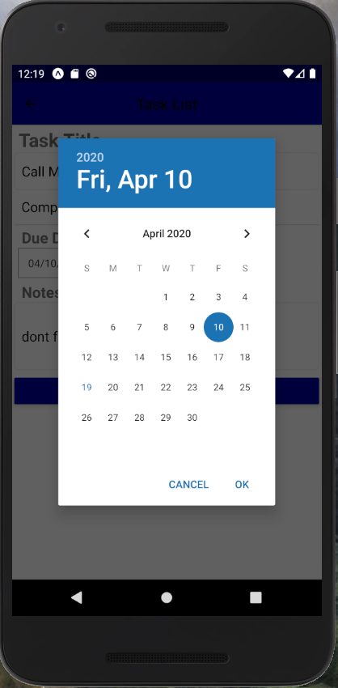

# Project 3 - React Native Task List - Fazil Shaikh
### COS 470 Spring 2020
---

## Project Title - Bitter Task List

Get an organized overview of everything that needs to be done and never lose track of important tasks ever again. With **Bitter Task List**, you can review upcoming tasks and create new ones with ease. Features include a task name, task description, completion status, and due date to keep it simple and straightforward. The tasks are ordered by date and completion so you always know what to prioritize. Bitter Task List helps you get stuff done!

## Basic instructions on usage

The application loads into a flat list view page where all the tasks are displayed.

To create a new task:
- Click **+** on the bottom right
- Fill in the Task name, Completion status, Due date, and Notes as needed.
- Press the **Save** button on the bottom of the formik form to save the task to the home page
> **Note:**  **Task name** is a required field and the rest are optional.

To edit a new task:
- Tap on the task to be edited
- Update the fields as needed.
- Press the **Save** button on the bottom of the formik form to save the task to the home page
- Alternatively, press **Back Button** on the phone or top left to return to the home page
> **Note:**  The home page orders tasks by date and completion.

Swiping a task right to left deletes it from the task list. 

You can also mark the tasks as completed in the home page by checking the radio button on the left of the task.

## Any special info we need to run the app

**Bitter Task List** users must pay an upfront fee of $999 for a one week trial and then an annual subscription fee is automatically charged to the user's credit card.
> **Note:**  Taxes and Convienience fee not included. Also, you will still find several unskippable advertisements per session.

In order to cancel your subscription follow the instructions below:
- You can't

## Lessons learned

From this project, I learned that the design and layout in React Native feels a lot more productive than both Kotlin and Swift after visualizing the end goal. The "hot reloading" feature in React Native was extremely helpful allowing for quick changes and live preview making it pretty time efficient. I also liked using native controls and native modules which supposedly improve performance are were faily intuitive to work with. The ability to create cross platform apps is a great plus with React Native. I did feel like the design view in XCode and Android Studio were more convinient when it came to setting up the components in an organized manner. Another con is the lack of ready-made components available in react native. The collection is quite small and I felt limited in terms of what I could do with my app. Luckily, there were some third-party component libraries I could choose from to get the job done. This is still a risk in terms of quality and reliability of that specific 3rd-part library since they are not created by the official developers and they might contain bugs or glitches or could even stop working after a while with new updates. Nonetheless, I enjoyed coding in React Native. The ready-to-apply components and my HTML/JavaScript experience made it fast and easy to work with.

## Demo

## Screenshots

